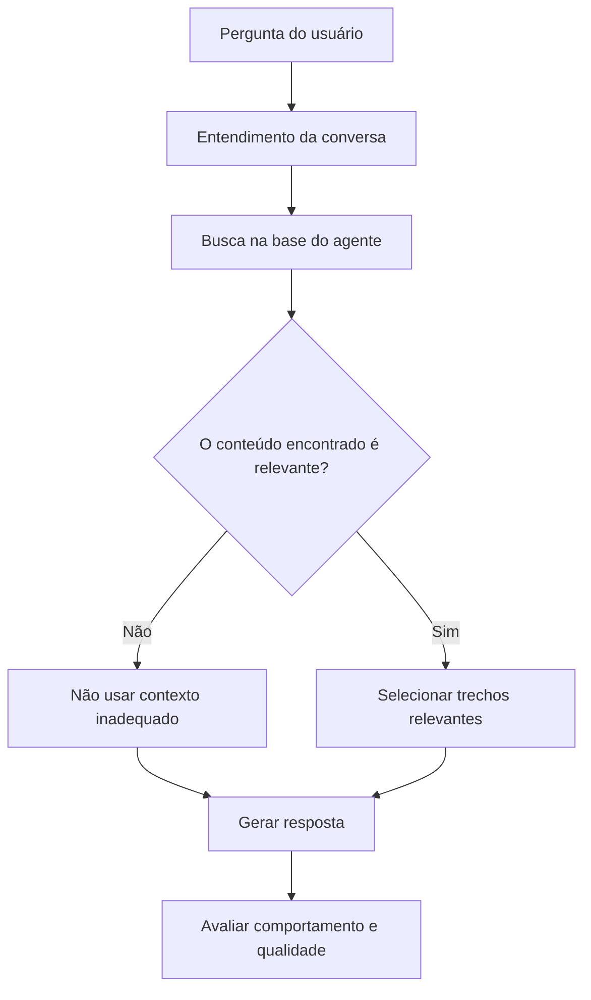

# ImpactAI

**IA especializada para apoiar organizações do Terceiro Setor — com recuperação de conhecimento, controle de relevância e avaliação contínua de qualidade.**

> Este é um case público de produto e engenharia. O código de produção, as bases de conhecimento, dados de usuários, credenciais e detalhes sensíveis da infraestrutura permanecem privados.

---

## Por que este projeto existe

O ImpactAI nasceu para transformar conhecimento especializado em apoio prático para organizações sociais.

A plataforma reúne agentes de IA voltados a diferentes temas de gestão e operação do Terceiro Setor, como planejamento, captação de recursos, projetos, prestação de contas, comunicação e voluntariado.

O desafio, porém, deixou de ser simplesmente **“fazer uma IA responder perguntas”**.

Em um produto real, uma resposta fluente pode estar errada, usar o documento errado, misturar conhecimentos de especialistas diferentes ou preencher lacunas com informações que parecem plausíveis.

Por isso, a pergunta central do desenvolvimento passou a ser:

> **Como fazer um agente responder somente com o contexto que realmente pertence ao seu domínio — e como perceber quando uma alteração aparentemente melhor piorou algo importante?**

Esse problema orientou a arquitetura, os testes e o processo de evolução do ImpactAI.

---

## O que foi construído

Cada agente combina três camadas diferentes:

1. **Comportamento** — como deve orientar, explicar, perguntar e reconhecer limites.
2. **Conhecimento** — documentos e conteúdos específicos de sua especialidade.
3. **Contexto da conversa** — o que já foi discutido com o usuário e precisa ser considerado na resposta seguinte.

De forma simplificada:



A tecnologia de recuperação é importante, mas o ponto mais relevante do projeto está nas **decisões ao redor dela**.

---

# Caso 1 — O “melhor resultado” da busca ainda pode estar errado

## O problema

A primeira versão da recuperação semântica buscava os trechos mais próximos da pergunta.

Tecnicamente, a busca funcionava.

Mas havia uma falha conceitual:

> uma busca sempre consegue encontrar os itens *mais próximos* disponíveis — mesmo quando nenhum deles é realmente relevante.

Isso significa que uma pergunta sobre um assunto poderia receber trechos de outro domínio apenas porque aqueles eram os resultados menos distantes encontrados.

O modelo então recebia aquele conteúdo como contexto e podia produzir uma resposta convincente sobre uma premissa errada.

### O risco

```text
Pergunta
   ↓
Busca os 6 resultados mais próximos
   ↓
Sempre existem "6 melhores"
   ↓
Mesmo que todos sejam ruins
   ↓
Contexto inadequado entra no prompt
   ↓
Resposta plausível, mas mal fundamentada
```

Esse é um problema perigoso porque a experiência visual pode parecer normal. A resposta continua bem escrita.

A falha está na origem do raciocínio.

---

## A decisão

A recuperação deixou de responder apenas:

**“quais são os resultados mais próximos?”**

e passou a responder também:

**“algum desses resultados é relevante o suficiente para ser usado?”**

Foi criado um gate de relevância: conteúdos abaixo de um limite calibrado não seguem para a geração da resposta.

Também foi mantido o isolamento por agente, para que a consulta de um especialista não utilize a base de outro.

```text
Busca semântica
      ↓
Resultados candidatos
      ↓
Critério mínimo de relevância
      ↓
   ┌───────────────┐
   │               │
Relevante       Insuficiente
   │               │
   ↓               ↓
Usar contexto    Descartar
```

---

## Como a hipótese foi validada

Um detalhe importante da investigação foi descobrir que um teste inicialmente utilizado para simular perguntas produzia uma percepção errada da qualidade da recuperação.

Em vez de aceitar o teste como suficiente, a validação foi refeita utilizando **embeddings de perguntas reais**.

O comportamento esperado passou a ser verificado em dois sentidos:

- uma pergunta de determinado domínio deve recuperar conteúdo relevante dentro da base correta;
- a mesma pergunta, consultada contra uma base de outro domínio sem relação, deve poder retornar **nenhum conteúdo**.

Isso parece simples, mas muda o significado da recuperação:

> **zero resultados pode ser uma resposta melhor do sistema do que seis resultados ruins.**

Esse foi um dos principais aprendizados técnicos do projeto.

---

# Caso 2 — Melhorar a média não é suficiente para aprovar uma mudança

Prompts e comportamentos dos agentes evoluem continuamente.

O problema é que uma alteração pode melhorar várias respostas e, ao mesmo tempo, piorar justamente um cenário crítico.

Avaliar apenas algumas conversas manualmente cria um risco: escolher a versão que “parece melhor”.

O ImpactAI passou a utilizar conjuntos estruturados de avaliação.

---

## O processo

As avaliações incluem cenários como:

- perguntas conceituais;
- situações operacionais;
- perguntas ambíguas;
- interpretação de métricas;
- falta de informação atual verificável;
- limites de atuação;
- proteção de dados;
- restrição de recursos;
- conflitos de prioridade.

Parte das perguntas é mantida fora do ciclo normal de ajuste — um conjunto de **holdout** — para verificar se a melhoria continua funcionando em situações que não foram usadas para construí-la.

Quando duas versões precisam ser comparadas, as respostas podem ser avaliadas de forma cega e com a posição alternada para reduzir viés de apresentação.

```text
Versão atual ─┐
              ├─> mesmas perguntas
Candidata ────┘
                    ↓
             comparação cega
                    ↓
          critérios de qualidade
                    ↓
             gate de aprovação
```

---

## A regra que mudou o processo

Uma candidata não é aprovada simplesmente porque “ganhou mais comparações”.

Existem falhas que bloqueiam a mudança.

Exemplos:

- inventar um dado atual que não pode ser confirmado;
- transformar hipótese em certeza;
- ultrapassar um limite importante do agente;
- perder uma capacidade central existente;
- revelar informação interna;
- apresentar uma orientação inadequada em um cenário crítico.

Na prática, isso já produziu uma situação importante: **versões com desempenho agregado melhor foram bloqueadas porque falharam em cenários críticos específicos**.

Esse comportamento é intencional.

Para um produto baseado em IA, melhorar a média não compensa qualquer tipo de regressão.

---

# Avaliação também precisa ser engenharia

Durante a evolução dos testes, outro problema apareceu: avaliações longas dependentes de APIs podem ser interrompidas por limite de uso, erro de rede ou falha externa.

Se todo o progresso existir apenas em memória, uma interrupção pode invalidar dezenas de execuções já realizadas.

Por isso, o processo de avaliação passou a incluir:

- persistência incremental dos resultados;
- retomada de execuções interrompidas;
- separação entre recuperação, geração e julgamento;
- reaproveitamento do que já foi concluído;
- validação do formato produzido pelos avaliadores;
- testes locais sem custo quando chamadas reais não são necessárias;
- execução ao vivo somente quando explicitamente habilitada.

O objetivo é simples: **o mecanismo usado para medir qualidade também precisa ser confiável.**

---

# Como diagnostico uma resposta ruim

Uma resposta inadequada não significa automaticamente que “o prompt está ruim”.

No ImpactAI, o diagnóstico separa diferentes possibilidades:

```text
Resposta inadequada
       │
       ├── a pergunta foi entendida corretamente?
       ├── a base certa foi consultada?
       ├── a busca encontrou conteúdo suficiente?
       ├── o conteúdo recuperado era realmente relevante?
       ├── o histórico da conversa foi preservado?
       ├── as instruções do agente estão corretas?
       ├── o modelo é adequado para essa tarefa?
       └── a própria base de conhecimento precisa melhorar?
```

Essa separação evita um erro comum em produtos de IA: **alterar o prompt para tentar corrigir um problema que nasceu em outra camada do sistema.**

---

# Qualidade e custo são decisões conjuntas

Outro princípio do projeto é não utilizar automaticamente o modelo mais caro disponível.

Cada tarefa é analisada considerando:

- complexidade;
- impacto de erro;
- volume de chamadas;
- custo;
- latência;
- capacidade necessária.

A diretriz é utilizar **o modelo de menor custo que entregue a qualidade necessária para aquela função**.

Isso vale tanto para respostas ao usuário quanto para tarefas auxiliares de avaliação e classificação.

Em produto, custo não é uma preocupação posterior à arquitetura. Ele faz parte dela.

---

# Meu papel no ImpactAI

O ImpactAI foi desenvolvido com apoio intensivo de ferramentas de IA para programação e investigação.

Isso não significa delegar o produto a um modelo.

Minha atuação inclui:

- concepção do produto e dos casos de uso;
- definição das especialidades dos agentes;
- organização das regras de comportamento;
- decisões sobre recuperação de conhecimento;
- desenho de critérios de relevância;
- criação de cenários de teste e aceitação;
- análise de falhas e regressões;
- definição do que deve bloquear uma mudança;
- priorização entre qualidade, custo e complexidade;
- revisão de implementações geradas com apoio de IA;
- condução dos ciclos de investigação, correção e validação;
- decisões sobre evolução do produto.

As ferramentas de IA são utilizadas como **copilotos de engenharia** para acelerar exploração de código, implementação, testes, refatoração, documentação e diagnóstico.

A responsabilidade sobre requisitos, decisões e validação permanece humana.

---

# Stack

A aplicação utiliza, entre outras tecnologias:

- **Next.js**
- **React**
- **TypeScript**
- **Node.js**
- **PostgreSQL / Supabase**
- **OpenAI APIs**
- **Embeddings e busca vetorial**
- **Docker**
- **Git / GitHub**

A stack é parte da solução, mas não é o foco deste case.

O foco está nas decisões necessárias para transformar uma integração com modelos de linguagem em um produto que possa ser testado, corrigido e evoluído.

---

# O que eu aprendi construindo o ImpactAI

### 1. Uma resposta convincente não prova que a recuperação funcionou

É preciso verificar o contexto que chegou ao modelo.

### 2. “Top results” não significa “relevant results”

Saber quando **não recuperar nada** é parte importante de um bom sistema de busca.

### 3. Prompt não é a única variável

Qualidade pode falhar na base, na recuperação, no histórico, na aplicação, na avaliação ou no modelo.

### 4. Avaliação precisa proteger contra regressões, não apenas produzir uma nota

Uma média melhor não deve esconder uma falha grave.

### 5. Testes de IA também podem ter vieses

Ordem das respostas, perguntas conhecidas demais e avaliadores mal instruídos podem alterar o resultado.

### 6. Custo precisa entrar cedo na decisão técnica

Usar um modelo maior em todas as etapas pode mascarar problemas arquiteturais e tornar o produto inviável em escala.

### 7. Desenvolvimento assistido por IA exige mais clareza, não menos

Quanto maior a velocidade de implementação, mais importantes ficam escopo, critérios de aceite e validação.

---

# Por que o código não está neste repositório

Este repositório é um **case de engenharia**, não uma versão open source do ImpactAI.

Permanecem privados:

- código-fonte de produção;
- bases de conhecimento;
- documentos utilizados pelos agentes;
- prompts internos completos;
- credenciais e configurações;
- dados de usuários;
- logs identificáveis;
- detalhes de infraestrutura;
- parâmetros operacionais que não são necessários para compreender as decisões apresentadas aqui.

A intenção é mostrar o problema, o raciocínio de engenharia e os aprendizados sem comprometer segurança, privacidade ou propriedade intelectual.

---

## Status

O ImpactAI continua em desenvolvimento.

Este case será atualizado à medida que novas decisões de arquitetura e novos aprendizados puderem ser compartilhados de forma pública e segura.
