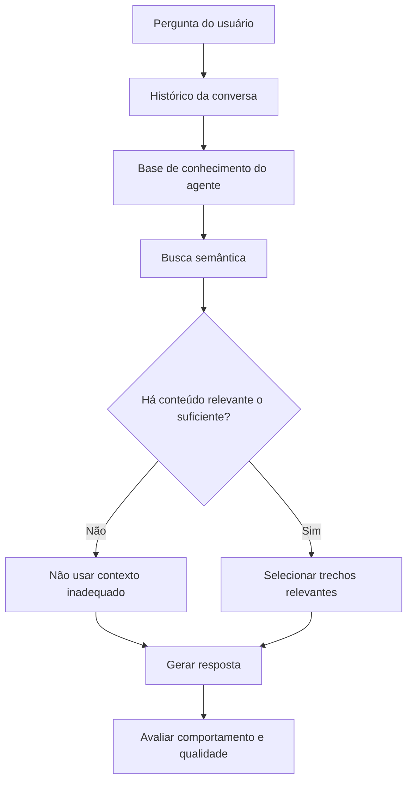

# Case de Engenharia — Agentes de IA com RAG e avaliação contínua

**Como uma plataforma de agentes especializados passou a tratar recuperação, relevância, diagnóstico e regressão como problemas de engenharia — e não apenas como “respostas de IA”.**

> Este é um case público de produto e engenharia. O código de produção, as bases de conhecimento, dados de usuários, credenciais, prompts internos completos e detalhes sensíveis da infraestrutura permanecem privados.

---

## O problema que mudou o projeto

Uma IA pode dar uma ótima resposta com a informação errada.

Esse foi um dos problemas mais importantes que encontrei construindo uma plataforma de agentes especializados para organizações do Terceiro Setor.

A aplicação reunia agentes voltados a temas diferentes, como planejamento, captação de recursos, projetos, prestação de contas, comunicação e voluntariado.

No começo, o desafio parecia simples:

> receber uma pergunta, buscar conhecimento relacionado e gerar uma boa resposta.

Mas uma resposta bem escrita não prova que o sistema funcionou.

Ela pode ter sido produzida com o contexto errado, a base errada, uma recuperação irrelevante ou uma instrução inadequada.

Foi aí que o problema deixou de ser apenas **“como fazer a IA responder?”** e passou a ser:

> **como garantir que ela responda a partir do contexto certo — e como perceber quando uma mudança aparentemente melhor piorou algo importante?**

Essa pergunta passou a orientar a arquitetura, os testes e o processo de evolução do sistema.

---

## Como o sistema é organizado

Cada agente combina três camadas diferentes:

1. **Comportamento** — como deve orientar, explicar, perguntar, priorizar e reconhecer limites.
2. **Conhecimento** — documentos e conteúdos específicos de sua especialidade.
3. **Contexto da conversa** — o que já foi discutido com o usuário e precisa chegar corretamente à próxima resposta.

De forma simplificada:



A tecnologia de recuperação é importante.

Mas as decisões mais difíceis apareceram justamente **ao redor dela**.

---

# Caso 1 — “Melhor resultado” não significa “resultado relevante”

## O problema

A primeira versão da recuperação semântica buscava os trechos mais próximos da pergunta.

Tecnicamente, funcionava.

Até surgir um problema conceitual:

> **uma busca sempre consegue encontrar os “melhores resultados disponíveis”.**

Mesmo quando nenhum deles é realmente relevante.

Na prática, o sistema podia recuperar seis trechos da base e entregar todos para a IA.

E a IA fazia o que sabe fazer muito bem:

transformava aquele contexto em uma resposta clara, organizada e convincente.

Só que havia uma pergunta mais importante:

> **aqueles conteúdos deveriam estar sendo usados para responder?**

Esse é um tipo de falha difícil de perceber olhando apenas para a resposta final.

O texto pode parecer ótimo.

O problema está no que aconteceu antes dele.

```text
Pergunta
   ↓
Busca os resultados mais próximos
   ↓
Sempre existem "melhores resultados"
   ↓
Mesmo quando nenhum é relevante
   ↓
Contexto inadequado chega ao modelo
   ↓
Resposta plausível, mas mal fundamentada
```

---

## A decisão

A busca não deveria responder apenas:

**“quais são os resultados mais próximos?”**

Precisava responder também:

**“eles são relevantes o suficiente para participar da resposta?”**

Foi criado um gate de relevância: conteúdos abaixo de um limite calibrado não entram no contexto do agente.

Também foi mantido o isolamento por agente, para que uma consulta não utilize a base de outro especialista.

```text
Busca semântica
      ↓
Resultados candidatos
      ↓
Critério mínimo de relevância
      ↓
   ┌───────────────┐
   │               │
Relevante       Insuficiente
   │               │
   ↓               ↓
Usar contexto    Descartar
```

---

## Como a hipótese foi validada

Durante a investigação, um teste inicialmente usado para simular perguntas produzia uma percepção enganosa da qualidade da recuperação.

A validação foi refeita com **embeddings de perguntas reais, escritas como usuários realmente perguntariam**.

A partir daí, o comportamento esperado passou a ser verificado nos dois sentidos:

- uma pergunta de determinado domínio deve recuperar conteúdo relevante dentro da base correta;
- a mesma pergunta, consultada contra uma base sem relação com o assunto, deve poder retornar **nenhum conteúdo**.

Foi daí que ficou um dos princípios mais importantes deste case:

> **em alguns casos, zero resultados é uma resposta melhor do sistema do que seis resultados ruins.**

A consequência prática é simples:

**uma resposta convincente não prova que a recuperação funcionou. Ela pode apenas esconder muito bem que não funcionou.**

---

# Caso 2 — Uma resposta ruim não diz onde o problema nasceu

Quando uma resposta final vem superficial, incoerente ou simplesmente errada, é tentador olhar primeiro para o prompt.

Mas, antes de o modelo escrever qualquer coisa, uma sequência inteira já aconteceu.

- A pergunta precisou ser interpretada.
- O histórico da conversa precisou chegar corretamente.
- Uma base de conhecimento precisou ser selecionada ou consultada.
- A busca recuperou determinados conteúdos.
- Algum critério decidiu quais deles eram relevantes.
- Esse contexto foi combinado com as instruções do agente.
- Só então o modelo respondeu.

O problema é que falhas diferentes ao longo desse caminho podem produzir exatamente o mesmo sintoma na tela:

**uma resposta inadequada.**

Por isso, o diagnóstico passou a ser separado por camada:

```text
Pergunta
   ↓
Histórico
   ↓
Base
   ↓
Recuperação
   ↓
Relevância
   ↓
Instruções
   ↓
Modelo
   ↓
Resposta
```

Essa separação evita um erro especialmente perigoso:

> **tentar corrigir no prompt um problema que nasceu em outra parte do sistema.**

Se a busca recuperou um contexto inadequado, uma instrução melhor não corrige a recuperação.

Se o histórico foi montado de forma incompleta, mudar o comportamento do agente não devolve uma informação que nunca chegou até ele.

Se a base não contém o conhecimento necessário, exigir uma resposta “mais precisa” pode apenas tornar o erro mais convincente.

Por isso, uma pergunta passou a orientar boa parte das investigações:

> **“O que exatamente chegou até o modelo para que essa resposta fosse possível?”**

Porque a resposta é o fim do pipeline.

**Não necessariamente a origem do problema.**

---

# Caso 3 — Uma versão ganhou mais testes e mesmo assim foi rejeitada

Melhorar a média não é suficiente para aprovar uma mudança.

Em uma das avaliações, comparei duas versões do mesmo agente em **36 julgamentos cegos**.

O resultado agregado foi:

- **12 vitórias** para a versão candidata;
- **10 vitórias** para a versão em uso;
- **14 empates**.

Olhando apenas para esse resultado, havia sinal de melhora.

Mas o processo também avaliava **falhas críticas**.

E nela aconteceu o contrário:

- versão em uso: **1 falha crítica**;
- versão candidata: **3 falhas críticas**.

Uma dessas falhas apareceu em um cenário simples de explicar.

A pergunta apresentava três problemas ao mesmo tempo:

- pouca adesão de novos voluntários;
- voluntários antigos desmotivados;
- falta de indicadores.

O agente precisava decidir o que priorizar primeiro.

A versão candidata colocou **indicadores antes de resolver o gargalo humano e operacional**.

Não era uma resposta absurda.

Esse era justamente o problema.

Ela era plausível, organizada e defensável isoladamente — mas priorizava a medição antes do problema que mais comprometia a operação naquele momento.

Foi aí que a avaliação deixou de responder apenas:

**“qual versão venceu mais vezes?”**

e passou também a perguntar:

**“onde ela piorou — e qual é o custo dessa piora?”**

A versão candidata teve desempenho agregado melhor.

Mesmo assim, não foi aprovada.

Dessa decisão ficou outro princípio que levo para avaliações de sistemas de IA:

> **melhor desempenho agregado não significa necessariamente um sistema melhor.**

Avaliar qualidade também é definir **o que pode melhorar e o que não pode piorar enquanto melhora.**

---

# Como as versões são avaliadas

As avaliações usam cenários diferentes para evitar que “qualidade” vire apenas uma impressão subjetiva.

Os conjuntos de teste incluem situações como:

- perguntas conceituais;
- problemas operacionais;
- perguntas ambíguas;
- interpretação de métricas;
- falta de informação atual verificável;
- limites de atuação;
- proteção de dados;
- poucos recursos;
- conflitos de prioridade.

Parte das perguntas é mantida fora do ciclo normal de ajuste — um conjunto de **holdout** — para testar a candidata em situações que não foram usadas para construí-la.

Quando duas versões precisam ser comparadas, as respostas são avaliadas de forma cega e com posição balanceada para reduzir viés de apresentação.

```text
Versão atual ─┐
              ├── mesmas perguntas
Candidata ────┘
                    ↓
             comparação cega
                    ↓
          critérios de qualidade
                    ↓
            falhas críticas?
                    ↓
             gate de aprovação
```

Uma candidata não é aprovada simplesmente porque ganhou mais comparações.

Algumas regressões podem bloquear a mudança, como:

- inventar uma informação que o contexto não sustenta;
- transformar hipótese em certeza;
- ultrapassar um limite importante;
- perder uma capacidade já existente;
- revelar informação interna;
- priorizar incorretamente um cenário crítico.

---

# Avaliação também precisa ser engenharia

Em avaliações longas dependentes de APIs, outro problema aparece: limite de uso, erro de rede ou falha externa podem interromper uma execução no meio.

Se todo o progresso existir apenas em memória, dezenas de resultados válidos podem ser perdidos.

Por isso, o processo de avaliação passou a incluir:

- persistência incremental;
- retomada de execuções interrompidas;
- separação entre recuperação, geração e julgamento;
- reaproveitamento do que já foi concluído;
- validação do formato retornado pelos avaliadores;
- testes locais quando chamadas reais não são necessárias;
- execução ao vivo somente quando explicitamente habilitada.

O princípio é o mesmo:

> **o mecanismo usado para medir qualidade também precisa ser confiável.**

---

# Qualidade e custo são decisões conjuntas

Outro princípio do projeto é não usar automaticamente o modelo mais caro disponível.

Cada tarefa é analisada considerando:

- complexidade;
- impacto de erro;
- volume de chamadas;
- custo;
- latência;
- capacidade necessária.

A diretriz é usar **o modelo de menor custo que entregue a qualidade necessária para aquela função**.

Isso vale tanto para respostas ao usuário quanto para tarefas auxiliares de avaliação, classificação e validação.

Em produto, custo não é uma preocupação posterior à arquitetura.

**Ele faz parte dela.**

---

# Meu papel neste projeto

O desenvolvimento foi feito com apoio intensivo de ferramentas de IA para programação, investigação e revisão.

Isso não significa delegar o produto a um modelo.

Minha atuação inclui:

- concepção do produto e dos casos de uso;
- definição das especialidades dos agentes;
- organização das regras de comportamento;
- decisões sobre recuperação de conhecimento;
- desenho de critérios de relevância;
- criação de cenários de teste e aceitação;
- análise de falhas e regressões;
- definição do que deve bloquear uma mudança;
- priorização entre qualidade, custo e complexidade;
- revisão de implementações geradas com apoio de IA;
- condução dos ciclos de investigação, correção e validação;
- decisões sobre evolução do produto.

As ferramentas de IA funcionam como **copilotos de engenharia** para acelerar exploração de código, implementação, testes, refatoração, documentação e diagnóstico.

A responsabilidade sobre requisitos, decisões e validação permanece humana.

---

# Stack

A aplicação utiliza, entre outras tecnologias:

- **Next.js**
- **React**
- **TypeScript**
- **Node.js**
- **PostgreSQL / Supabase**
- **OpenAI APIs**
- **Embeddings e busca vetorial**
- **Docker**
- **Git / GitHub**

A stack é parte da solução, mas não é o centro deste case.

O foco está nas decisões necessárias para transformar uma integração com modelos de linguagem em um sistema que possa ser **investigado, testado, corrigido e evoluído com evidência**.

---

# O que permanece privado

Este repositório é um **case público de engenharia**, não uma versão open source do produto.

Permanecem privados:

- código-fonte de produção;
- nome e identidade pública do produto;
- bases de conhecimento;
- documentos utilizados pelos agentes;
- prompts internos completos;
- credenciais e configurações;
- dados de usuários;
- logs identificáveis;
- detalhes sensíveis da infraestrutura;
- parâmetros operacionais que não são necessários para compreender as decisões apresentadas aqui.

A intenção é mostrar o problema, o raciocínio, a evidência e as decisões de engenharia sem comprometer segurança, privacidade ou propriedade intelectual.

---

## Status

O sistema continua em desenvolvimento.

Este case pode ser atualizado quando novos problemas e decisões trouxerem aprendizados diferentes dos que já estão documentados aqui.
