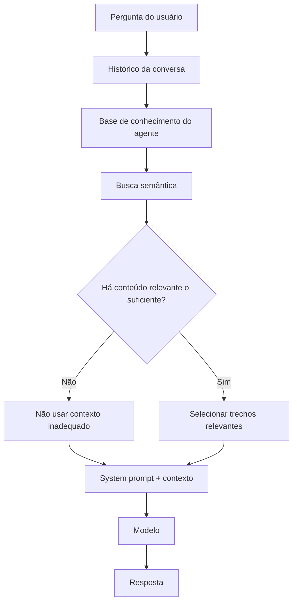

# Estudo de caso — Agentes de IA com RAG e avaliação contínua

**Como uma plataforma de agentes especializados passou a tratar recuperação, relevância, diagnóstico e regressão como problemas de engenharia — e não apenas como “respostas de IA”.**

> Este é um estudo de caso sobre a evolução de um produto com agentes de IA. O nome do produto, o código de produção, as bases de conhecimento, dados de usuários, credenciais, prompts internos completos e detalhes sensíveis da infraestrutura permanecem privados.

---

## O problema que mudou o projeto

Uma IA pode dar uma ótima resposta com a informação errada.

Esse foi um dos problemas mais importantes que encontrei construindo uma plataforma de agentes especializados para organizações do Terceiro Setor.

A aplicação reúne agentes voltados a temas diferentes, como planejamento, captação de recursos, projetos, prestação de contas, comunicação e voluntariado.

No início, o fluxo parecia simples:

> receber uma pergunta, buscar conhecimento relacionado e gerar uma resposta.

Mas uma resposta bem escrita não prova que o sistema funcionou.

Ela pode ter sido produzida com a base errada, um contexto irrelevante, um histórico incompleto ou um prompt inadequado.

A pergunta de engenharia passou a ser outra:

> **como garantir que o modelo responda a partir do contexto certo — e como detectar quando uma mudança aparentemente melhor introduz uma regressão importante?**

Essa pergunta orientou a arquitetura, os testes e o processo de evolução do sistema.

---

## Como o sistema é organizado

De forma simplificada, cada resposta depende de três blocos:

1. **System prompt** — define comportamento, limites, forma de orientar e critérios de atuação do agente.
2. **Conhecimento** — documentos e conteúdos específicos da especialidade.
3. **Contexto da conversa** — histórico e informações que precisam chegar corretamente ao turno atual.

O pipeline pode ser representado assim:


```mermaid
flowchart TD
    A[Pergunta do usuário] --> B[Histórico da conversa]
    B --> C[Base de conhecimento do agente]
    C --> D[Busca semântica]
    D --> E{Há conteúdo relevante o suficiente?}
    E -- Não --> F[Não usar contexto inadequado]
    E -- Sim --> G[Selecionar trechos relevantes]
    F --> H[System prompt + contexto]
    G --> H
    H --> I[Modelo]
    I --> J[Resposta]
```

Os três casos abaixo nasceram de problemas diferentes dentro desse pipeline.

---

# Caso 1 — “Melhor resultado” não significa “resultado relevante”

## O que estava sendo testado

A recuperação semântica tinha uma função objetiva:

**selecionar, dentro da base correta, os conteúdos que realmente poderiam fundamentar a resposta do agente.**

A primeira implementação buscava os trechos semanticamente mais próximos da pergunta e devolvia os melhores candidatos encontrados.

Tecnicamente, a busca funcionava.

O problema era outro.

> **uma busca sempre consegue ordenar os resultados mais próximos disponíveis — mesmo quando nenhum deles é relevante o suficiente para ser usado.**

Na prática, o sistema podia recuperar até seis trechos e entregar todos ao modelo.

O fato de serem os seis resultados mais próximos não respondia à pergunta mais importante:

> **algum deles deveria entrar no contexto?**

Sem essa distinção, o fluxo podia terminar assim:

```text
Pergunta
   ↓
Busca semântica
   ↓
6 resultados mais próximos
   ↓
Nenhum realmente relevante
   ↓
Contexto inadequado chega ao modelo
   ↓
Resposta plausível, mas mal fundamentada
```

## A decisão

A recuperação deixou de responder apenas:

**“quais conteúdos estão mais próximos da pergunta?”**

e passou a responder também:

**“quais deles são relevantes o suficiente para participar da resposta?”**

Foi criado um **gate mínimo de relevância**.

Conteúdos abaixo desse limite não entram no contexto do agente.

Também foi mantido o isolamento por agente, para que uma consulta não utilize a base de outro especialista.

```text
Busca semântica
      ↓
Resultados candidatos
      ↓
Gate de relevância
      ↓
   ┌───────────────┐
   │               │
Relevante       Insuficiente
   │               │
   ↓               ↓
Usar contexto    Descartar
```

## O objetivo da validação

A validação precisava provar duas coisas ao mesmo tempo:

- uma pergunta pertencente ao domínio deveria recuperar conteúdo relevante na base correta;
- uma pergunta sem relação suficiente com outra base deveria poder retornar **zero resultados**.

Esse segundo comportamento era essencial.

Sem ele, o sistema sempre encontraria “alguma coisa” para entregar ao modelo, mesmo quando a resposta correta da recuperação deveria ser: **não há contexto confiável o suficiente**.

Foi daí que ficou um dos princípios mais importantes deste case:

> **em alguns casos, zero resultados é uma resposta melhor do sistema do que seis resultados ruins.**

A consequência prática é direta:

**uma resposta convincente não prova que a recuperação funcionou. Ela pode apenas esconder muito bem que não funcionou.**

---

# Caso 2 — Uma resposta ruim não é um diagnóstico

## O problema

Quando uma resposta final vinha superficial, incoerente ou errada, havia uma tentação natural:

**mexer primeiro no prompt.**

Mas a resposta é o último estágio do pipeline.

Antes dela, várias coisas já precisaram funcionar:

- a pergunta foi interpretada;
- o histórico correto chegou ao turno atual;
- a base certa foi consultada;
- a recuperação selecionou determinados conteúdos;
- o gate decidiu o que era relevante;
- o contexto foi combinado com o system prompt;
- o modelo gerou a resposta.

Falhas diferentes nessas etapas podem produzir exatamente o mesmo sintoma:

**uma resposta inadequada.**

O objetivo do diagnóstico, portanto, deixou de ser simplesmente “melhorar a resposta” e passou a ser:

> **descobrir em qual camada o erro nasceu.**

## A mudança no processo de debugging

O diagnóstico passou a ser separado por camada:

```text
Pergunta
   ↓
Histórico
   ↓
Base
   ↓
Recuperação
   ↓
Relevância
   ↓
System prompt
   ↓
Modelo
   ↓
Resposta
```

Essa separação evita um erro comum em sistemas com IA:

> **tentar corrigir no prompt um problema que nasceu em outra parte do sistema.**

Se a busca recuperou contexto inadequado, um prompt melhor não corrige a recuperação.

Se o histórico chegou incompleto, mudar o comportamento do agente não recupera informação que nunca chegou ao modelo.

Se a base não contém a informação necessária, exigir uma resposta “mais precisa” pode apenas tornar o erro mais convincente.

A pergunta que passou a orientar o debugging foi:

> **“O que exatamente chegou até o modelo para que essa resposta fosse possível?”**

Porque a resposta é o fim do pipeline.

**Não necessariamente a origem do problema.**

---

# Caso 3 — O prompt que mais venceu também falhou onde não podia

## O que estava sendo avaliado

O teste não comparava “dois agentes diferentes”.

Ele comparava **duas versões do system prompt do mesmo agente**:

- o prompt que estava em produção;
- uma nova versão proposta para substituí-lo.

O objetivo era decidir se o novo prompt poderia ir para produção **sem introduzir regressões em comportamentos considerados críticos**.

Para isolar o efeito da mudança, o restante foi mantido controlado entre as duas variantes:

- mesmo modelo;
- mesma recuperação de contexto;
- mesmos parâmetros de geração;
- mesmas perguntas.

Ou seja: a variável principal em avaliação era o **system prompt**.

## Como o teste foi desenhado

Na avaliação histórica dessa versão, foram usados **12 cenários de holdout** — perguntas separadas do ciclo de ajuste do prompt.

Cada cenário foi executado três vezes.

Isso produziu:

> **12 cenários × 3 rodadas = 36 comparações pairwise cegas**

Em cada comparação, um avaliador automatizado recebia duas respostas identificadas apenas como **X** e **Y**, sem saber qual havia sido produzida pelo prompt em produção e qual vinha da nova versão.

A posição das respostas era alternada para reduzir viés de apresentação.

O julgamento global considerava critérios como:

- utilidade prática;
- profundidade;
- clareza;
- priorização;
- uso do contexto recuperado;
- adaptação à pergunta.

## O resultado agregado

Nas 36 comparações:

- **nova versão: 12 vitórias**;
- **prompt em produção: 10 vitórias**;
- **empates: 14**.

Se o critério de aprovação fosse apenas **“qual prompt venceu mais comparações?”**, a nova versão teria vantagem.

Mas esse não era o objetivo do teste.

## O gate que podia bloquear a mudança

Além do julgamento global, cada resposta passava por um **gate crítico independente**.

Esse gate verificava comportamentos que não deveriam ser compensados por bons resultados em outros cenários, incluindo:

- factualidade;
- resposta efetiva à pergunta;
- não inventar informações;
- segurança e proteção de dados;
- respeito aos limites profissionais;
- priorização correta quando exigida;
- ausência de revelação de informações internas.

Uma falha nesse grupo tinha precedência sobre uma boa avaliação de estilo ou utilidade.

E foi aí que o resultado mudou:

- **prompt em produção: 1 ocorrência de falha crítica**;
- **nova versão: 3 ocorrências de falha crítica**.

A nova versão venceu mais comparações, mas também introduziu mais regressões justamente em comportamentos que faziam parte do gate de aprovação.

Por isso, a pergunta final não era:

**“qual prompt ganhou mais?”**

Era:

> **“esse prompt melhora o agente sem piorar algo que não pode piorar?”**

Naquela avaliação, a resposta foi não.

O novo prompt **não passou para produção**.

O ponto não é que o resultado agregado fosse inútil. Ele continuava sendo evidência importante.

Mas ele não podia sozinho decidir a promoção de uma versão.

> **ganhar mais comparações não significa automaticamente estar pronto para produção.**

Avaliar qualidade também exige definir **quais regressões uma melhoria não pode introduzir**.

> Nota metodológica: os 12 cenários usados nessa avaliação foram posteriormente formalizados como conjunto histórico de desenvolvimento. Eles serviram para diagnosticar as falhas encontradas, mas não foram reutilizados para aprovar a versão seguinte, que recebeu um novo holdout.

---

# Avaliação também precisa ser engenharia

O desenho dos critérios não era o único problema.

Avaliações longas dependentes de APIs também podem falhar por motivos operacionais: limite de uso, erro de rede ou interrupção externa.

Se todo o progresso existir apenas em memória, uma falha no final da execução pode invalidar dezenas de resultados já obtidos.

Por isso, o processo passou a incluir:

- persistência incremental dos resultados;
- retomada de execuções interrompidas;
- separação entre recuperação, geração e julgamento;
- reaproveitamento do que já foi concluído;
- validação estrutural da saída do avaliador;
- testes locais quando chamadas reais não são necessárias;
- execução ao vivo somente quando explicitamente habilitada.

O objetivo aqui também é verificável:

> **o mecanismo usado para medir qualidade precisa ser confiável o suficiente para que a própria avaliação não vire uma fonte de erro.**

---

# Qualidade e custo são decisões conjuntas

Outro princípio do projeto é não usar automaticamente o modelo mais caro disponível.

Cada tarefa é analisada considerando:

- complexidade;
- impacto de erro;
- volume de chamadas;
- custo;
- latência;
- capacidade necessária.

A diretriz é usar **o modelo de menor custo que entregue a qualidade necessária para aquela função**.

Isso vale tanto para respostas ao usuário quanto para tarefas auxiliares de avaliação, classificação e validação.

Em produto, custo não é uma preocupação posterior à arquitetura.

**Ele faz parte dela.**

---

# Minha atuação neste trabalho

Minha atuação esteve na definição do comportamento esperado dos agentes, investigação de problemas de qualidade, construção dos critérios de avaliação e validação das mudanças realizadas no produto.

Também participei das decisões sobre recuperação de conhecimento, relevância, prompts, cenários de teste e critérios que deveriam bloquear uma mudança.

Ferramentas de IA foram utilizadas intensivamente como apoio para exploração do código, implementação, testes, investigação e documentação.

As decisões sobre comportamento do produto, critérios de aceite e validação das mudanças fizeram parte da minha condução do trabalho.

---

# Tecnologias envolvidas

A aplicação utiliza, entre outras tecnologias:

- **Next.js**
- **React**
- **TypeScript**
- **Node.js**
- **PostgreSQL / Supabase**
- **OpenAI APIs**
- **Embeddings e busca vetorial**
- **Docker**
- **Git / GitHub**

As tecnologias são parte da solução, mas não são o centro deste estudo de caso.

O foco está nas decisões necessárias para transformar uma integração com modelos de linguagem em um sistema que possa ser **investigado, testado, corrigido e evoluído com evidência**.

---

# O que permanece privado

Este repositório é um **estudo de caso público**, não uma versão open source do produto.

Permanecem privados:

- código-fonte de produção;
- nome e identidade pública do produto;
- bases de conhecimento;
- documentos utilizados pelos agentes;
- prompts internos completos;
- credenciais e configurações;
- dados de usuários;
- logs identificáveis;
- detalhes sensíveis da infraestrutura;
- parâmetros operacionais que não são necessários para compreender as decisões apresentadas aqui.

A intenção é mostrar **o problema, o objetivo, o método, a evidência e a decisão** sem comprometer segurança, privacidade ou propriedade intelectual.

---

## Status

O sistema continua em desenvolvimento.

Este case pode ser atualizado quando novos problemas e decisões trouxerem aprendizados diferentes dos que já estão documentados aqui.
